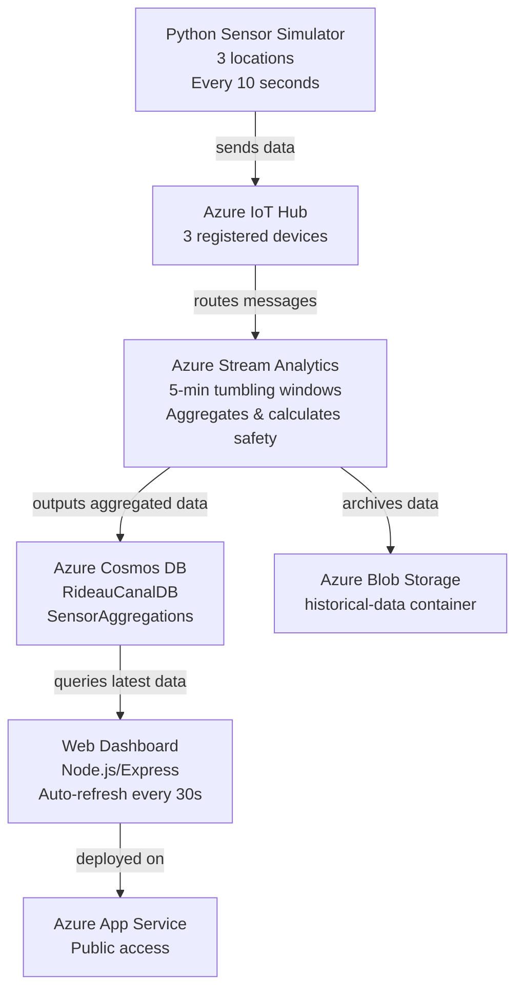

## Data Flow

1. **Sensors** : Send data every 10 seconds to IoT Hub
2. **IoT Hub** : Routes messages to Stream Analytics
3. **Stream Analytics** : Processes in 5-minute windows, calculates aggregations and safety status
4. **Cosmos DB** : Stores processed data for dashboard queries
5. **Blob Storage** : Archives all data for historical analysis
6. **Dashboard** : Queries Cosmos DB and displays real-time data
7. **App Service** : Hosts the dashboard for public access

